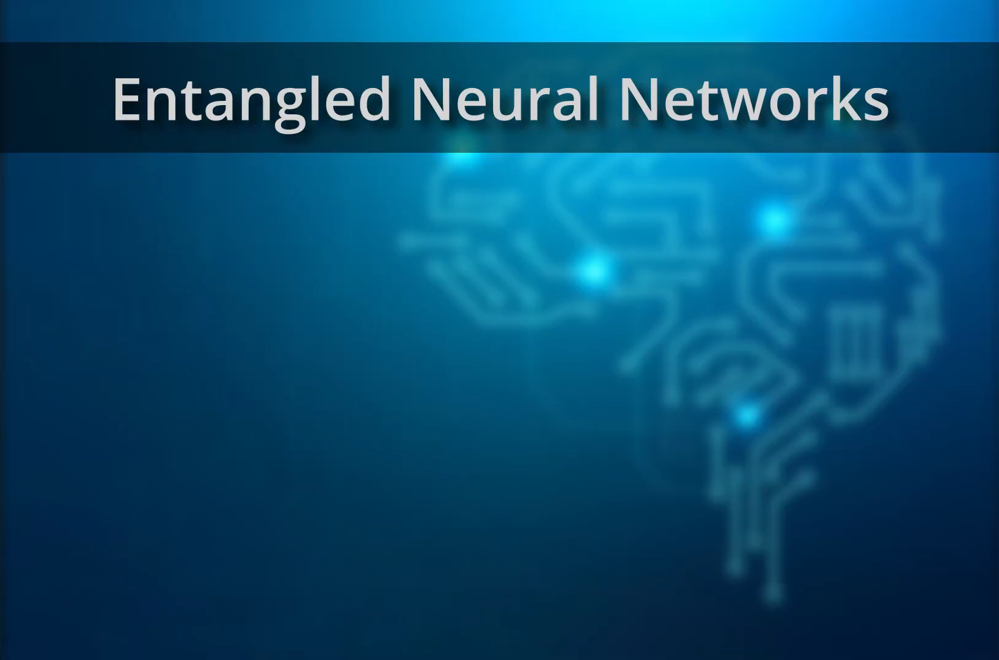

# Entangled Neural Networks (ENNs)

## What is this?

Assigned as the project for the ARI2201 unit, Entangled Neural Networks are an attempt at implementing quantum computing principles into traditional Artificial Neural Networks (ANNs).

Feel free to learn more through the video below:

### How does it work?

TODO

### How do I use it?
TODO