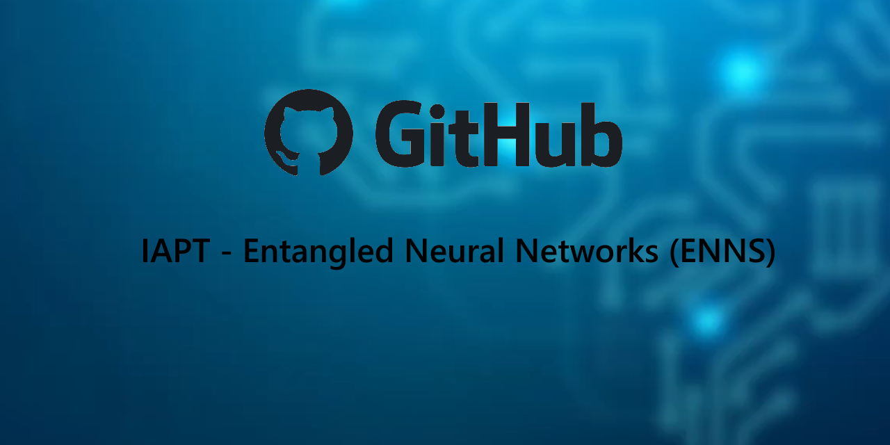

# Entangled Neural Networks (ENNs)

## What is this?

Assigned as the project for the ARI2201 unit, Entangled Neural Networks are an attempt at implementing quantum computing principles into traditional Artificial Neural Networks (ANNs).

Feel free to learn more through the video below:

### How does it work?
Entangled Neural Networks are Quantum-Classical hybrid neural networks. This is done by using a trainable quantum circuit as an intermediary layer before the final classification layer in an otherwise 'normal' neural network architecture.

### How do I use it?
This project consists of 2 parts; one based on the MNIST dataset and another based on the IRIS dataset. Both a hybrid neural network and classical neural network were created for the two datasets to compare performance of traditional machine learning (ML) and quantum ML.  
To run the classical neural networks, the main.py script can be accessed and run.  
To run the hybrid neural networks, the hybrid_network.py script can be accessed and run.  
To compare performance after both networks and saving loss history, the evaluation.py script can be accessed and run.